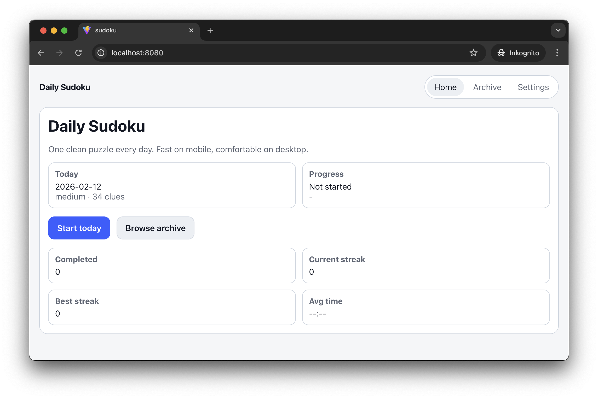
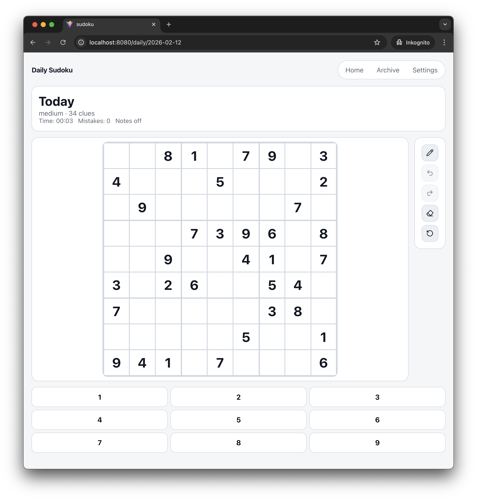

# Daily Sudoku

A clean, fast Sudoku web app with daily puzzles. Built for both mobile and desktop.




## Features

- **Daily Puzzles** - One unique puzzle every day, seeded by date
- **Multiple Difficulties** - Choose from Easy, Medium, Hard, or Expert levels
- **Puzzle Archive** - Browse and play past daily puzzles
- **Statistics Tracking** - Track completed games, streaks, and average completion times
- **Auto-Save** - Game progress is automatically saved to local storage
- **Theme Support** - Light and dark mode
- **Undo/Redo** - Full history navigation for moves
- **Notes Mode** - Add pencil marks to cells
- **Error Validation** - Instant feedback on conflicts
- **Responsive Design** - Optimized for both mobile and desktop play

## Tech Stack

- **React 19** - UI framework
- **TypeScript** - Type safety
- **Vite** - Build tool and dev server
- **React Router** - Client-side routing
- **Lucide React** - Icon library

## Getting Started

### Prerequisites

- Node.js (v18 or higher recommended)
- npm or yarn

### Installation

```bash
# Clone the repository
git clone <repository-url>
cd sudoku

# Install dependencies
npm install

# Start development server
npm run dev
```

The app will be available at `http://localhost:5173`

### Build for Production

```bash
npm run build
```

The production-ready files will be in the `dist` directory.

### Preview Production Build

```bash
npm run preview
```

## Project Structure

```
src/
├── components/        # Reusable UI components
│   ├── AppShell.tsx   # Main layout wrapper
│   ├── GameToolbar.tsx
│   ├── NumberPad.tsx
│   └── SudokuBoard.tsx
├── hooks/             # Custom React hooks
│   └── useSudokuGame.ts
├── lib/               # Core logic and utilities
│   ├── storage/       # LocalStorage management
│   ├── sudoku/        # Puzzle generation, solving, validation
│   ├── theme.ts       # Theme utilities
│   └── time.ts        # Time formatting
├── routes/            # Page components
│   ├── HomePage.tsx
│   ├── DailyPage.tsx
│   ├── ArchivePage.tsx
│   └── SettingsPage.tsx
└── App.tsx            # Root component with routing
```

## How It Works

### Puzzle Generation

Puzzles are generated using a seeded random number generator based on the date, ensuring that everyone gets the same puzzle on the same day. The generator:

1. Creates a valid, complete Sudoku solution
2. Removes numbers strategically based on difficulty level
3. Ensures the puzzle has a unique solution

### Data Persistence

All game state, statistics, and settings are stored in browser `localStorage`:

- Active game progress (board state, time, moves)
- Completion statistics (games completed, streaks, times)
- User settings (difficulty, theme preferences)

## Development

### Code Quality

```bash
# Run ESLint
npm run lint
```

### Type Checking

```bash
# Run TypeScript compiler in check mode
npm run build
```

## License

This project is licensed under the MIT License - see the [LICENSE.txt](LICENSE.txt) file for details.
